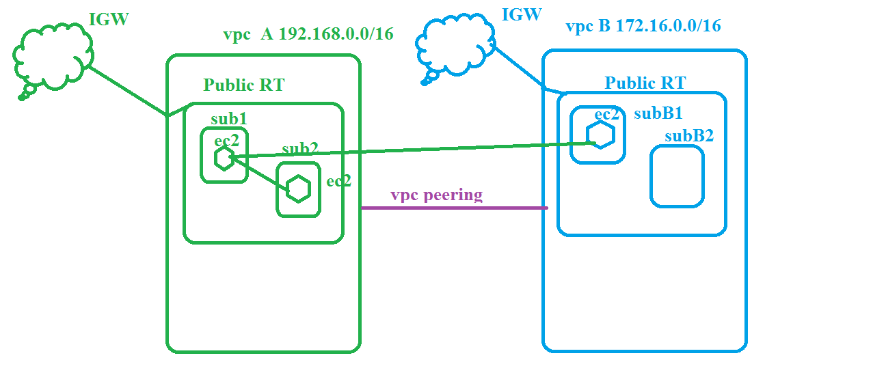
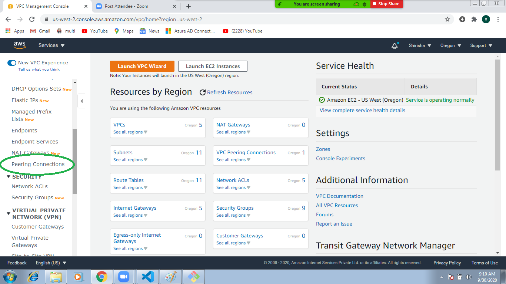
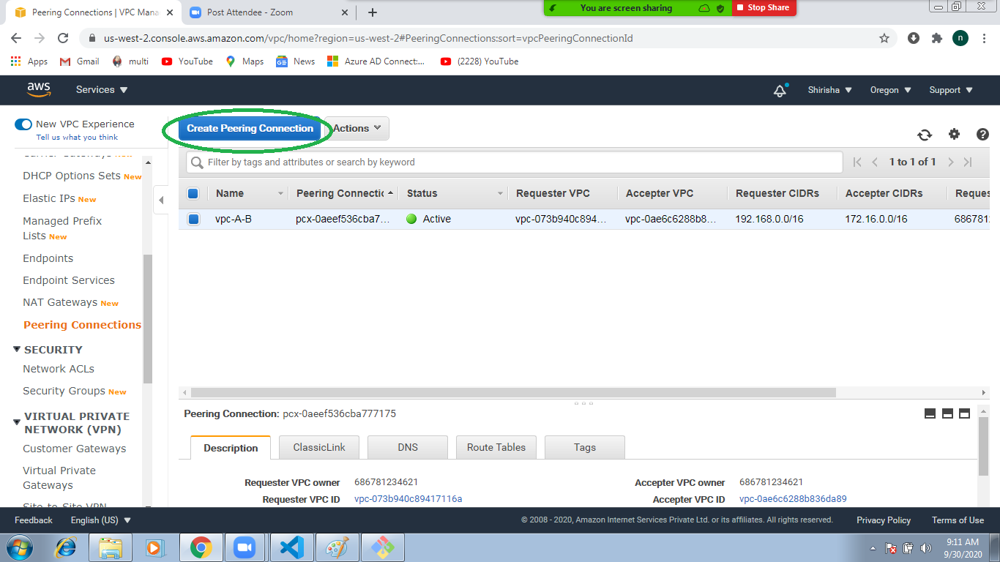
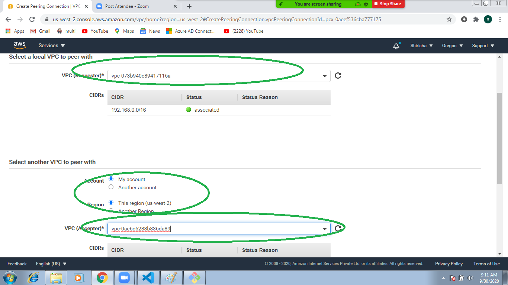

## VPC Peering 
 
   1. enable comminication to one vpc to another vpc  
   2. vpc are should be different CIDR 
   3. we can do 
      1. same region 
      2. different region 
      3. different account
   
### VPC A
   1. create vpc A with 192.168.0.0/16 
   2. create IGW attach to vpc A
   3. create public RT
   4. public Rt route to IGW 
   5. create 2 subnets 
        1. subA1 192.168.0.0/24
        2. subA2 192.168.1.0/24
   6. associate to public RT 
   7. create security group 
   8. launch ec2 machines on subnets 
       1. launch ec2 machine in subnetA1 
         1. step 3 configure instance details 
            1. select network vpc-A
            2. select subnet  subA1
            3. enable public ip address 
       2. launch ec2 machine in subA2 
## Test connection 
   1. login into machine A 
   2. ping to machine B ```ping Privateipaddressofmachineb```
   3. pinging 
## VPC B 
   1. create vpc B ```172.16.0.0/16```
   2. create IGW and attach to VPC B 
   3. create public RT 
   4. Public RT routed to IGW 
   5. create subnet and associate public RT 
       1. create subnet ```172.16.0.0/24``` 
       2. associate public RT 
   6. create Security group  
   7. launch ec2 machine in subnet 
## testing 
   1. login into vpc A ec2 machine 
   2. ping to Vpc B ec2 machine 
   3. not pining (different network directly not possible) 
## VPC peering 
   1. create vpc peering connection 
      
   2. goto vpc service 
      
   3. select peering connections
      
   4. accept the request
   5. add routes 
       1. in VPC A add VPC B cidr in RT
       2. in VPC B add VPC A cidr in RT 
## delete 
   1. delete peering connection
   2. delete ec2 machines
   3. delete vpc's