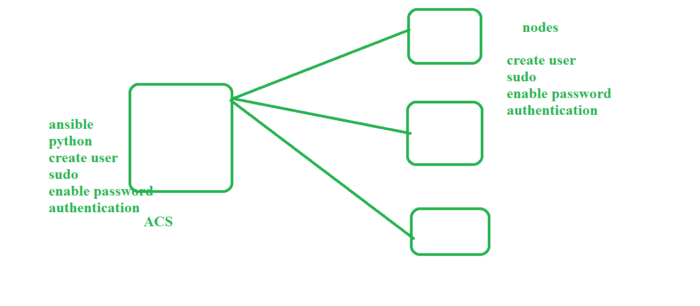
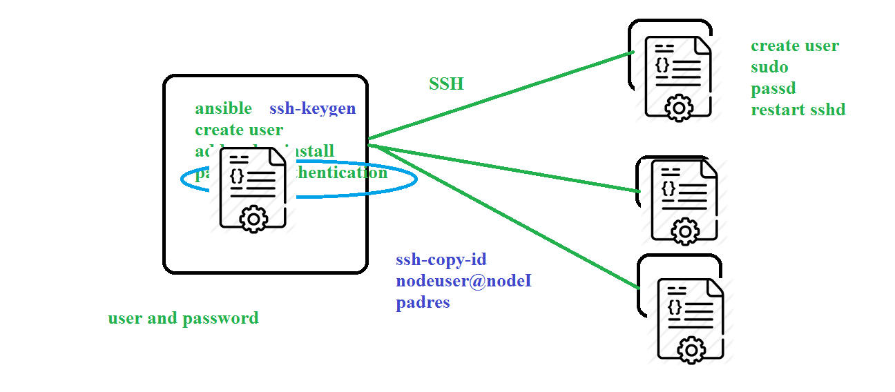

## Ansible Setup:

   1. ACS
      1. launch EC2 machine and login
      2. install ansible 
         ```
            sudo apt update
            sudo apt install software-properties-common
            sudo apt-add-repository --yes --update ppa:ansible/ansible
            sudo apt install ansible
         ```
      3. create user
         ```
         adduser ansible
         ```
      4. assign sudo permission (sudo user means he can do anything(install , remove, etc) except add user and assign privilege) 
         ```
         visudo
         ```
         for save file```nano -- ctrl+x and press y and enter ```
         
      5. enable password authentication (aws provide by default key based authentication here we need passwordauthentication)
         ```
         vi /etc/ssh/sshd_config
         ```
         for save file ```Esc:wq```
         
      6. restart sshd 
         ```
         systemctl restart sshd
         ```
   2. Nodes (3) 
      * No need to install ansible
      1. create user
      2. assign sudo permission
      3. enable password authentication
      4. retstart sshd 
## establish connection from __ACS__ to __Nodes__
   1. login into Ansible Control Server ```ssh usernameofACS@ACSPublicIpaddress```
     eg: ```ssh ansible@54.45.0.5``` 
   2. generate keys ```ssh-keygen``` one-time-activity
   3. copy the key from ACS to each node ```ssh-copy-id nodeusername@nodeipaddress``` 
## __Inventory__
   1. it contains all node Ip address
   2. default inventory file ```/etc/ansible/hosts```
   3. open file ```sudo vi /etc/ansible/hosts``` add 3 node ip address in inventory file 
   4. run command in ACS for Test connection ```ansible -m ping all``` 
 


## __vi__ and __vim__ Editor
   1. open file ```vi filename``` and ```vim fiename```
   2. save and exit file ```Esc:wq```
   3. exit file without save content ```Esc:q!``` 
## __nano__ editor 
   1. open file with nano editor using ```nano filename```
   2. save content and exit file ```ctrl+x Press Y and Enter```
   3. exit file without save content ```ctrl+x Press N and Enter``` 
